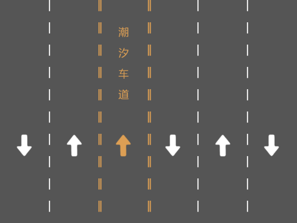
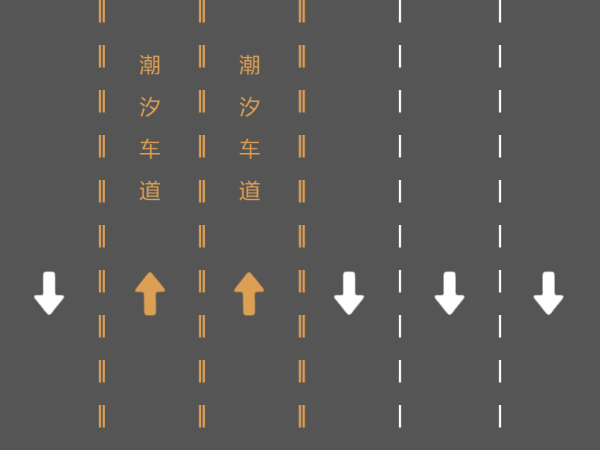

[ENGLISH](./README.md)

<h1 align="center">TidalLane</h1>
[](https://npmjs.org/package/@faintout/tidal-lane)


[](https://npmjs.org/package/@faintout/tidal-lane)

### 基于JS+Canvas开发车道线+潮汐车道绘制。

- 支持车道线、潮汐车道、行进方向、潮汐车道文字显示。
- js引入方式则需注掉export default 等导出方法。
- import 引入需使用export 导出使用。
- **需以服务形式启动查看**

### 使用方法

```html
    <script>
        const roadList = [{
                type: "bottom",
                tidal: false,
            },
            {
                type: 'top',
                tidal: true,
            },
        ]
        const tidalLane = new TidalLane('tidalLane', roadList)

        //更新
        setTimeout(() => {
            const tempRoadList = [{
                    type: "bottom",
                    tidal: false,
                },
                {
                    type: 'top',
                    tidal: false,
                },

            ]
            //更新潮汐车道
            tidalLane.setRoadList(tempRoadList)
        }, 3000)
    </script>
```
### 配置项
```javascript
const tidalLane = new TidalLane($1, $2)
//$1 - 为外层画布的ID String
//$2 - 绘制道路所需的数组 Array 
{
    type: 'top', //为行进方向  top|bottom
    tidal: false,  //是否为潮汐车道 Boolean
},
```

<h3 align="center">示例</h3>

<p align="center">
    
</p>
<hr/>
<p align="center">
    
</p>


演示效果请以文件查看
